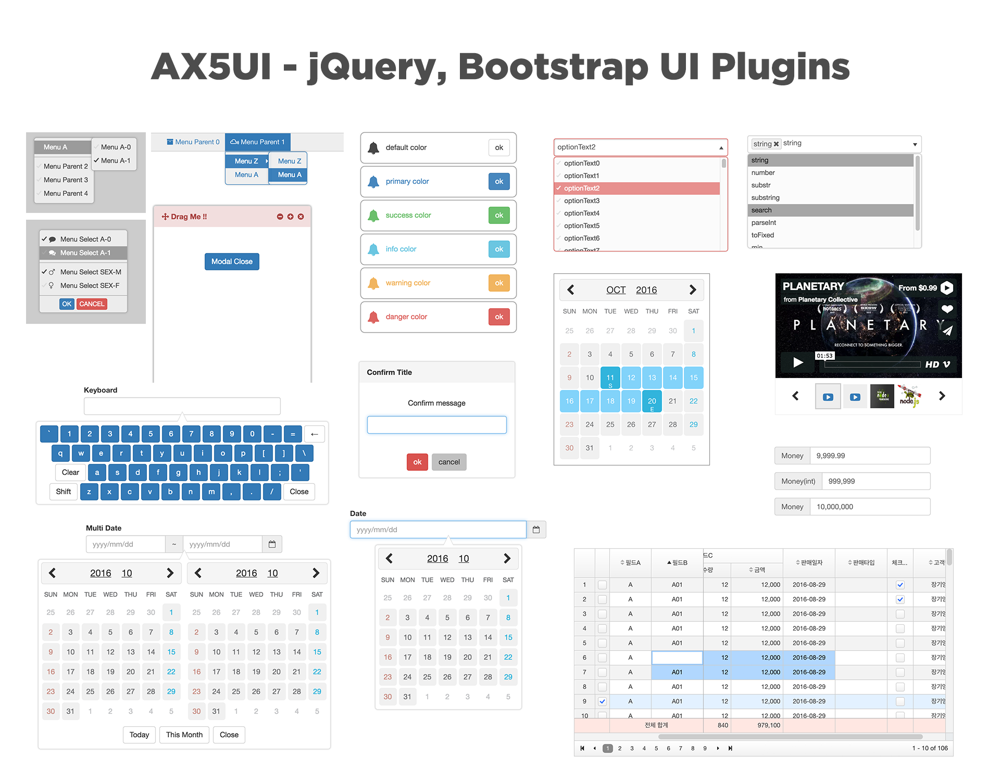



# What is it!
AX5UI는 jQuery/Bootstrap과 함께 사용하는 HTML5 웹표준 Javascript UI 플러그인입니다.  (데모 : http://ax5.io)
AX5UI를 사용하기 위해서는 "HTML, JS, CSS"에 대한 기본지식이 있어야 합니다. "HTML, JS, CSS"에 대한 지식은 검색엔진을 이용하여 쉽게 얻을 수 있습니다.

### jQuery
UI 플러그인 개발을 보다 빠르고 합리적으로 하기위해 jQuery 라이브러리를 사용하고 있습니다. AX5UI에서 jQuery 라이브러리의 역할은 원하는 엘리먼트를 찾고 지우고 추가하고 이벤트를 연결하는데 사용합니다.
jQuery는 전세계에게 가장 많은 개발자가 사용중인 JS 라이브러리 입니다 (http://jquery.com/). 


###Bootstrap
Bootstrap은 각종 레이아웃, 버튼, 입력창등의 디자인을 CSS와 Javascript로 미리 만들어진 프레임워크 입니다. 
웹 디자인의 혁명이라 불릴정도로 폭발적인 반응이 있었고, 전 세계적으로 가장 많이 사용된 프론트앤드 프레임워크 중에 하나입니다.
AX5UI의 테마시스템은 SCSS코드로 제작되어, 최종 산출물인 CSS파일이 만들어지는 구조로 설계되었습니다.
SCSS코드내 변수구조가 Bootstrap SCSS구조와 호환되도록 설계되어있고, 입력창등의 CSS 클래스 사용법을 Bootstrap와 같은 구조에서 최적화 되도록 개발 및 테스트 되었습니다.

### AX5UI
AX5UI는 AXISJ의 개발경험을 가지고 설계 개발된 소프트웨어 입니다.
수많은 UI라이브러리를 사용자에게 제공하면서 가지게 된 생각을 AX5UI에 담아내려고 애썻습니다.
- 어떻게 하면 개발자들의 개발시간을 단축 시킬 수 있을까?  
- 어떻게 하면 개발자들이 즐겁게 개발 할 수 있을까?  
- 어떻게 하면 개발자들이 원하는 기능을 언제든 편하게 추가 하고 공유 할 수 있을까?  

이런 고민들을 해결하기 위해 몇가지 새로운 방법들이 필요했습니다.
- 프레임워크보다는 플러그인 형태로 개발하여 가볍게 추가하고 다른 플러그인들과 함께 사용하는데 편리하게 만들어야 한다.
- 각각의 UI 플러그인들을 상호 호환되면서 독립적이어야 한다.
- NPM이나 Bower처럼 편리한 배포 시스템이 있어야 한다.
- 플러그인을 하나의 레포지터리에서 개발할 수 있어야 하고, 각각의 UI 플러그들은 각각의 레포지터리로 배포 되어야 한다.
- 모든 과정을 자동화 하여 개발자는 코딩만 즐길 수 있어야 한다.

앞으로 더 많은 개선과 노력이 있어야 쓸만한 UI 플러그인으로 성장해 나아가 겠지만, 
함께 만들어 간다는 마음으로 참여 해주시면 감사하겠습니다.

---

# How to Use

## install

AX5UI는 별도의 설치과정 없이 소스코드를 웹페이지에 연결하는 것으로 준비가 완료 됩니다. 다음의 방법들 중 하나로 소스코드를 다운로드 받을 수 있습니다.
- Github에서 직접 다운로드.
- NPM 패키지 매니지먼트 이용.
- Bower 패키지 매니지먼트 이용.
- 마지막으로 `git clone https://github.com/ax5ui/ax5ui-kernel` 하기

If the source code download 
```html
<script type="text/javascript" src="https://cdnjs.cloudflare.com/ajax/libs/jquery/1.12.4/jquery.min.js"></script>
<script type="text/javascript" src="https://cdn.rawgit.com/ax5ui/ax5core/master/dist/ax5core.min.js"></script>

<link rel="stylesheet" type="text/css" href="https://cdn.rawgit.com/ax5ui/ax5ui-dialog/master/dist/ax5dialog.css" />
<script type="text/javascript" src="https://cdn.rawgit.com/ax5ui/ax5ui-dialog/master/dist/ax5dialog.min.js"></script>
```
위와 같이 웹페이지에 AX5UI 플러그인을 import하세요. 여기 까지 할 수 있다면 성공입니다. 만일 이 과정이 어렵다면 지금 당장 브라우저를 닫고 주변에 널려있는 개발자에게 전화하세요.

### Structure
AX5UI를 여러분의 웹 애플리케이션에 추가하면, AX5UI는 브라우저에 `ax5`라는 변수만을 사용합니다. 
`ax5`오브젝트안에는 `ax5.util`, `ax5.mustache`, `ax5.info`, `ax5.ui`등의 키가 담겨 있고 AX5UI의 UI클래스들을 추가하게 되면 `ax5.ui`아래에 담기게 됩니다.

**ax5core**
```html
<script type="text/javascript" src="https://cdnjs.cloudflare.com/ajax/libs/jquery/1.12.4/jquery.min.js"></script>
<script type="text/javascript" src="https://cdn.rawgit.com/ax5ui/ax5core/master/dist/ax5core.min.js"></script>
```
```
console.log(ax5);
// {guid: 1, info: Object, util: Object, ui: Object, mustache: Object}
```

**add ax5ui-dialog**
```html
<script type="text/javascript" src="https://cdnjs.cloudflare.com/ajax/libs/jquery/1.12.4/jquery.min.js"></script>
<script type="text/javascript" src="https://cdn.rawgit.com/ax5ui/ax5core/master/dist/ax5core.min.js"></script>

<link rel="stylesheet" type="text/css" href="https://cdn.rawgit.com/ax5ui/ax5ui-dialog/master/dist/ax5dialog.css" />
<script type="text/javascript" src="https://cdn.rawgit.com/ax5ui/ax5ui-dialog/master/dist/ax5dialog.min.js"></script>
```
```
console.log(ax5.ui);
// {root: Function.., dialog: Function..}
```
When you add the UI plug-in, as shown above is a structure that is added to the sub-ax5.ui.


## Customizing

You can modify the source code from the source in the `src` folder.
More detailed information will be covered next time. For now, just ask.


## Question

https://github.com/ax5ui/ax5ui-kernel/issues 

- - -

# How to Play(소스코드 수정하기)
1. Fork this Origninal repository to your repository.
2. Clone your repository to your desktop.
3. Open Terminal
4. Move to git folder (Folder Name : ax5ui-kernel)
5. Type this instruction : npm install
6. Run Gulp task
7. Build a test environment (src/ax5ui-**/test) > bower install
8. Coding & test

### npm install
```
npm install
```
> Installing npm(Node Package Modules) to manage the node.js modules. please refer to an Internet

- Type this instruction : gulp default
    * cf1> or Type this instruction : gulp
    * cf2> current Location : ax5ui-kernel

### Gulp
```
toms-mac:ax5ui-kernel tom$ gulp default
[13:25:56] Using gulpfile ~/Works-OSS/ax5ui/ax5ui-kernel/gulpfile.js
[13:25:56] Starting 'default'...
[13:25:57] Finished 'default' after 227 msa
```
> if you success, you can see this screen.
> if you fail to run gulp, the reason is ['you don't have permission' or 'npm is not installed'] please refer to an Internet this keyword will help you : 
> - npm init
> - npm install -g gulp
> - npm install --global gulp-cli
> - sudo npm install --global gulp-cli

### Bower
각각의 UI 폴더안에는 `test폴더`가 있습니다. `test폴더`는 각각의 UI를 개발 할 때 테스트 하는 용도로 사용됩니다.
`bower.json`은 `test폴더`에서 필요한 plugins들을 관리하는 파일입니다. 

```
npm install -g bower
bower install
```

`test 폴더`로 이동후에 위의 명령을 터미널에 실행하면 `test폴더`안에 bower_components 폴더가 생성되고 필요한 플러그인들이 다운로드 됩니다.
그런다음 html파일을 열어 개발중인 코드를 테스트 할 수 있습니다. 


## Structure
```
ax5ui-kernel/
├── build/
|   ├── jsdoc2md.sh (jsdoc to markdown shell script)
|   ├── split.sh (gitsubsplit shell script)
|   └── split_jenkins.sh (gitsubsplit shell script for jenkins)
├── dist/
├── src/
|   ├── ax5core/
|   |   ├── dist/
|   |   ├── src/
|   |   ├── test/
│   |   ├── API...
│   |   ├── bower.json
│   |   ├── deploy.sh
│   |   ├── package.json
│   |   └── README.md
|   ├── ax5ui-autocomplete/
|   |   ├── dist/
|   |   |   ├── ax5autocomplete.css
|   |   |   ├── ax5autocomplete.js
|   |   |   └── ax5autocomplete.min.js
|   |   ├── src/
|   |   |   ├── modules/
|   |   |   |   ├── ax5autocomplete-tmpl.js
|   |   |   |   └── ax5autocomplete-util.js
|   |   |   ├── scss/
|   |   |   |   ├── _ax5autocomplete.scss
|   |   |   |   └── _ax5autocomplete_variables.scss
|   |   |   ├── ax5autocomplete.js
|   |   |   └── ax5autocomplete.scss
|   |   ├── test/
|   |   |   ├── bower.json (you can run `$bower install` initialize test environment)
|   |   |   └── index.html
|   |   ├── bootstrap.min.js
│   |   ├── chartist.min.js
│   |   ├── demo.js
│   |   ├── jquery-1.10.2.js
│   |   └── light-bootstrap-dashboard.js
|   ├── ax5ui-.../
|   └── ax5ui-.../
|
├── .babelrc
├── .gitignore
├── gulpfile.js
├── LICENSE
├── package.json
├── README.md
└── README-kor.md
```


- - -

[](https://github.com/axisj) [](https://github.com/ax5ui) [](https://github.com/thomasJang)


